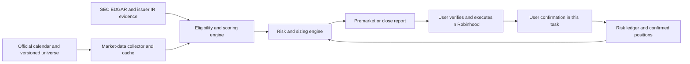

# Stock Monitor Design

**Date:** 2026-08-14

**Status:** Approved in conversation; awaiting review of this written specification

**Workspace:** `/Users/jbuenosantan/Documents/ChatGPT/Stock Monitor`

## Summary

Stock Monitor is a rules-first, human-in-the-loop swing-trading decision-support system for a $5,000 Robinhood cash account. It ranks at most three liquid U.S. stock or ETF candidates for two-to-ten-trading-day holds, calculates a bounded position size, records the evidence behind each signal, and reviews confirmed positions near the close.

The system never accesses Robinhood credentials, places an order, assumes that a recommendation was executed, or promises a return. Its first objective is to prove disciplined behavior under a $250 monthly drawdown limit. The user's desired $1,000-$2,000 monthly gain is not an acceptance criterion because that would require an unreliable 20%-40% monthly return on $5,000.

## Confirmed Decisions

- The $5,000 is disposable risk capital and is separate from living expenses and emergency savings.
- The hard monthly drawdown limit is $250.
- The user has basic options experience.
- The intended holding period is two to ten trading days.
- Robinhood remains a cash account throughout initial validation.
- All brokerage execution is manual.
- The monitor runs before the market and near the close and reports in the existing Codex task.
- The user records executions by replying in the task with a simple confirmation.
- Initial live trades use ordinary shares or ETFs only; option equivalents are paper-only.
- The chosen strategy is a rules-first, stock-first swing monitor.
- A free Alpaca paper-only account supplies the initial market-data API key.

## Goals

1. Produce a small, auditable set of qualified candidates or an explicit `NO TRADE` result.
2. Keep every planned live loss at or below $25 while live exposure is capped at $1,000 during validation.
3. Preserve a timestamped record of signals, sources, user-confirmed executions, exits, and rule adherence.
4. Fail closed when market data, event timing, source evidence, position state, or risk state is stale or uncertain.
5. Forward-test the process for at least four weeks and twenty completed stock/ETF signals before considering a second options-validation phase.

## Non-Goals

- Guaranteed income or a fixed monthly return
- Automatic or semi-automatic brokerage execution
- Access to Robinhood credentials, cookies, session tokens, or private APIs
- Margin, leverage, short selling, 0DTE options, same-day options, or naked options
- Penny stocks, OTC securities, low-float momentum names, leveraged/inverse ETFs, or rumor-driven trades
- High-frequency or same-day trading; this is a conservative project policy, not a claim that fully paid cash-account transactions can never occur intraday
- Paid data redistribution or automated scraping of licensed index pages

## Operating Model

### Premarket run

At 8:45 a.m. America/New_York on an open U.S. market day, the system:

1. Verifies the official market calendar, current data entitlement, cache freshness, source health, and strategy circuit breakers.
2. Scores the approved universe using completed-session data plus appropriately labeled delayed or single-venue observations.
3. Verifies event and source evidence for finalists.
4. Emits zero to three candidates with an entry trigger, maximum permitted entry price, recommended initial stop, first target, whole-share quantity, planned risk, invalidation conditions, evidence links, score breakdown, feed name, and quote timestamp.
5. Emits `NO TRADE` when no candidate passes every rule.

The report is a plan, not an executable instruction. Entry is permitted only after 9:35 a.m. ET, only if the stated trigger occurs, and only after the user checks the current price and bid/ask spread in Robinhood.

### User execution confirmation

The system changes live position state only from an unambiguous user reply. The minimum accepted forms are:

```text
ACCOUNT CHECK settled_cash <AMOUNT> pending_orders <COUNT> unlogged_positions <COUNT> AT <TIME_ET>
BOUGHT <TICKER> <WHOLE_SHARES> shares @ <PRICE> AT <TIME_ET>; BID <BID> ASK <ASK>; STOP SET @ <STOP_PRICE>
STOP UPDATED <TICKER> @ <STOP_PRICE> AT <TIME_ET>
STOP FILLED <TICKER> <WHOLE_SHARES> shares @ <PRICE> AT <TIME_ET>
SOLD <TICKER> <WHOLE_SHARES> shares @ <PRICE> AT <TIME_ET>
SKIPPED <TICKER>
OPTION PAPER OPEN <OCC_CONTRACT> BID <BID> ASK <ASK> DELTA <DELTA> OI <OPEN_INTEREST> VOLUME <DAILY_VOLUME> AT <TIME_ET>
OPTION PAPER MARK <OCC_CONTRACT> BID <BID> ASK <ASK> AT <TIME_ET>
OPTION PAPER CLOSE <OCC_CONTRACT> BID <BID> ASK <ASK> AT <TIME_ET>
```

Ticker matching is case-insensitive, but the stored ticker is uppercase. Quantities and prices must be positive; option delta must be between zero and one, while open interest and volume must be non-negative integers. A same-day time can use `HH:MM ET`; a delayed report must use a full ISO-8601 timestamp with UTC offset. The message timestamp is stored separately and never substituted silently for a missing execution time. A live buy is eligible only after a same-session account check confirms settled cash, pending-order count, and whether any positions are missing from the monitor. Its confirmation also records the contemporaneous Robinhood bid and ask so the spread gate can be audited; omission records the exposure but marks it noncompliant.

Every syntactically clear execution is recorded, even when its quantity, price, stop, or state violates the plan. A violating execution is marked `NONCOMPLIANT_RECONCILIATION_REQUIRED`, included immediately in exposure and close reviews, and pauses new entries until reconciled. An ambiguous message is stored as a pending raw event without mutating quantities and prompts for clarification. Idempotency keys prevent a repeated reply from creating a duplicate execution.

The confirmed fill price recomputes exposure, planned loss to the recommended stop, and reward-to-risk. A fill above the report's maximum permitted entry price is recorded as real exposure but is noncompliant and triggers reconciliation. The journal distinguishes `recommended_stop` from `user_confirmed_stop`; a position without a confirmed protective stop is marked `STOP UNVERIFIED` and pauses new entries.

### Near-close run

At 3:30 p.m. ET on a normal session, the system reviews every reported position, including noncompliant or unreconciled exposure, and reports one of:

- `PROVISIONAL HOLD - VERIFY CURRENT ROBINHOOD PRICE`
- `PROVISIONAL TIGHTEN STOP - VERIFY CURRENT ROBINHOOD PRICE`
- `PROVISIONAL EXIT - VERIFY CURRENT ROBINHOOD PRICE`
- `POSITION UNVERIFIED`
- `STOP UNVERIFIED`
- `RECONCILIATION REQUIRED`

The report includes current data timestamps, estimated unrealized profit/loss, R-multiple, recommended stop, separately identified user-confirmed stop, target, holding age, upcoming events, and the evidence for the provisional action. Because the free feed is delayed or single-venue, a near-close action becomes actionable only after the user checks the current Robinhood price. The review cannot replace the protective stop entered and confirmed by the user.

On a scheduled 1:00 p.m. ET early close, the close review runs at 12:30 p.m. ET instead. Calendar-gated tasks may wake at both 12:30 and 3:30, but exactly one close report is emitted for a session.

## System Boundaries and Data Flow



The implementation uses six bounded components:

1. **Market-data adapter:** authenticates to Alpaca, downloads and caches bars/snapshots, and labels every observation with feed and timestamp.
2. **Reference-evidence adapter:** checks the market calendar, SEC filings, issuer investor-relations pages, earnings timing, and corporate actions.
3. **Screening and scoring engine:** applies eligibility gates and produces an auditable score without knowing portfolio state.
4. **Risk engine:** owns exposure, position sizing, stops, circuit breakers, settlement availability, and promotion gates.
5. **Journal and report layer:** stores durable state, exports inspectable records, and renders the two user-facing reports.
6. **Scheduled-task adapter:** invokes the same tested commands from Codex scheduled tasks attached to the current task.

No component contains brokerage execution logic.

## Universe and Eligibility

The live allow-list contains manually reviewed S&P 500 and Nasdaq-100 members plus approved liquid broad-market and sector ETFs. Because index membership and ETF holdings can carry automation or redistribution restrictions, the initial system does not scrape index pages. It stores a versioned, internal-use snapshot with source URL, effective date, acquisition method, and checksum. The list is reviewed monthly; a stale or conflicting snapshot blocks every new recommendation until the list is reviewed.

Every candidate must satisfy all of these gates:

- Last completed-session price is at least $10.
- Twenty-session average dollar volume is at least $100 million.
- Twenty-session median share volume is at least one million shares.
- A stock's versioned universe record contains a primary-sourced free-float value of at least 50 million shares; a missing or lower value disqualifies the stock. ETFs do not use a corporate free-float field and instead must pass the price, dollar-volume, share-volume, spread, and product-type gates.
- The security is not OTC, halted, leveraged/inverse, a penny stock, or within 90 calendar days of its initial public listing.
- For a stock, no earnings report, merger vote, regulatory decision, known court ruling, or other binary event is expected during the intended holding window. Earnings timing is confirmed by the issuer and falls after the planned exit; an estimated or unknown date that could overlap the hold disqualifies the stock.
- For an ETF, issuer earnings are `N/A`; a scheduled liquidation, split, material index-methodology change, or fund reorganization during the intended hold disqualifies the ETF.
- The regular-hours spread observed by the user in Robinhood at the trigger is no more than 0.25% of the midpoint.
- The initial stop is calculated by the selected setup formula, produces planned risk of no more than $25, and sets the first target at least 2R above the planned entry after tick rounding.
- The thesis does not depend on social-media activity or an unverified rumor.
- If both SPY and QQQ satisfy `close[t] < SMA50[t]` and `SMA50[t] < SMA50[t-10]`, live long entries pause and otherwise-qualified signals are paper-only.

All calculations use split-adjusted completed-session bars. Let `t` be the latest completed session; `SMA20`, `SMA50`, and `EMA20` use closing prices, and `ATR14` uses Wilder's true-range average.

Only two setup families are allowed during validation:

1. **Pullback and reclaim:** the four stock-trend conditions in the score below are all true; at least one low from `t-2` through `t` inclusive is within `EMA20 +/- 0.5 * ATR14`; and `close[t]` is above both `EMA20[t]` and `close[t-1]`. The raw trigger is `max(high[t], high[t-1]) + 0.05 * ATR14`; the recommended stop is `min(low[t-2], low[t-1], low[t]) - 0.10 * ATR14`.
2. **Breakout with confirmation:** resistance is the maximum high from `t-20` through `t-2` inclusive; `close[t]` lies from `resistance - 0.5 * ATR14` through `resistance`; and `ATR14 / close[t]` is between 1% and 5%. The raw trigger is `resistance + 0.05 * ATR14`; the recommended stop is `min(low[t-2], low[t-1], low[t]) - 0.10 * ATR14`.

A setup receives its 20 points only when every listed condition is true; otherwise it is ineligible. The raw trigger is rounded up to the valid price increment. A conservative slippage allowance is added before sizing to produce the maximum permitted limit entry, and the first target is `planned_entry + 2 * (planned_entry - stop)`. Trigger, planned entry, stop, and target use only data available before the report and cannot be revised after observing the outcome.

## Candidate Score

Eligible candidates receive a deterministic score out of 100:

| Category | Points | Formula |
|---|---:|---|
| Trend and market regime | 25 | Five points each for `close > SMA20`, `SMA20[t] > SMA20[t-5]`, `close > SMA50`, `SMA50[t] > SMA50[t-10]`, and at least one of SPY/QQQ satisfying both `close > SMA50` and `SMA50[t] > SMA50[t-10]` |
| Relative strength | 20 | For five-session instrument return minus its market benchmark: 10 points at or above the eligible-universe 75th percentile, 5 at the 50th-74.99th percentile, otherwise 0; repeat for twenty-session stock return minus mapped sector-ETF return, or ETF return minus its market benchmark |
| Setup quality | 20 | Twenty points only when every formula for one approved setup family passes; otherwise the candidate is ineligible |
| Volume confirmation | 15 | Twenty-session average dollar volume: 5 points at or above $500M, 3 at $250M-$499.99M, 1 at $100M-$249.99M; 5 points when the maximum `volume / SMA20(volume)` in the last three sessions is at least 1.2; 5 points when mean volume on sessions with `close[d] > close[d-1]` exceeds mean volume on sessions with `close[d] < close[d-1]` over the last ten sessions; unchanged sessions are excluded and missing either group earns 0 |
| Verified catalyst/context | 10 | 10 points for a relevant primary issuer/SEC event published in the last 10 calendar days, 5 for one 11-30 days old, otherwise 0; the report stores the event type, date, fact, and primary URL |
| Liquidity and execution | 10 | Median share volume: 5 points at or above 5M, 3 at 2M-4.99M, 1 at 1M-1.99M; delayed-feed spread: 5 points at or below 0.10%, 3 at 0.1001%-0.20%, 1 at 0.2001%-0.25%, otherwise 0 |

At the 8:45 run, the liquidity-score spread sample is the newest positive consolidated bid/ask quote timestamped from 3:55 through 4:00 p.m. ET in the previous regular session. If that window has no quote, the candidate is stale and ineligible. A separate premarket observation is displayed with its own timestamp but does not determine the regular-hours liquidity score. Spread percentage is `(ask - bid) / ((ask + bid) / 2)`. A candidate must score at least 80 before publication, but final eligibility remains conditional on the user separately confirming a current Robinhood spread of 0.25% or less after 9:35 a.m. Reports show every component; an agent narrative cannot override a failed gate or raise the arithmetic score.

The sector-ETF mapping is versioned with the universe. SPY is the market benchmark for stocks and ETFs other than SPY; VTI is the benchmark for SPY itself. A stock catalyst is relevant only when its primary source is classified as financial results/guidance, a material agreement, a product or regulatory milestone, capital allocation, management/governance, or an acquisition/disposition. An ETF receives catalyst/context points only for a dated official fund-sponsor or index-provider notice relevant to the fund; otherwise it receives zero without being rejected. Catalyst points measure verified taxonomy and recency, not inferred social sentiment. Lowered guidance, a restatement, default/bankruptcy, enforcement action, product recall/regulatory rejection, going-concern language, or dilutive financing activates an adverse-event exclusion gate for a new stock long position and cannot earn catalyst points. An ambiguous classification disqualifies the candidate until reviewed. Every classification and matching source fact is stored for review.

### Primary candidate and validation portfolio

The report can display three candidates, but only one becomes the session's `PRIMARY` candidate. Eligible candidates sort by total score descending, then twenty-session relative-strength percentile descending, then twenty-session average dollar volume descending, then ticker ascending. If the canonical validation portfolio lacks exposure, risk, settled-cash, or position capacity at publication time, there is no primary entry that day.

Only the primary candidate may create a Phase 1 portfolio entry or live recommendation. The other two are labeled `WATCHLIST_SHADOW` and their outcomes are informational; they do not enter expectancy, drawdown, adherence, or the twenty-trade count. If the primary does not trigger, no secondary candidate substitutes that session. A user-reported purchase of a shadow candidate is preserved as real but off-policy exposure and forces reconciliation.

The canonical Phase 1 portfolio always applies the one-entry-per-day, two-open-position, $1,000 exposure, $50 combined-risk, weekly stop, and monthly stop rules. It uses paper fills for every primary candidate whether the user trades it live or skips it. A separate actual-live ledger tracks user executions and must also remain within its hard limits.

## Risk and Position Management

### Exposure and sizing

During validation:

- Maximum live exposure: $1,000
- Maximum open positions: two
- Maximum planned loss per position: $25
- Maximum combined planned open-position risk: $50
- Maximum new live entries: one per trading day
- Whole shares and settled cash only

The settlement ledger starts from the user-confirmed $5,000 cash balance and derives expected settled cash from confirmed buys and sells. Robinhood equity, ETF, and option sales settle one trading day later (T+1), excluding weekends and market closures; sale proceeds remain unavailable for new cash-account purchases until then. Only $1,000 may be deployed by the strategy during validation. Because the monitor cannot see Robinhood, a same-session `ACCOUNT CHECK` is required before each live entry and must use account-wide settled buying power excluding instant deposits and unsettled proceeds. Any deposit, withdrawal, pending order, unrelated trade, or unlogged position must be reflected in that check and reconciled; otherwise new entries fail closed. The local ledger is an estimate until matched to this user-confirmed brokerage value.

For a long candidate:

```text
trigger_price = ceil(raw_trigger / tick_size) * tick_size
stop_price = floor(raw_stop / tick_size) * tick_size
slippage_allowance = max(0.001 * trigger_price, delayed_spread_amount / 2)
planned_entry = ceil((trigger_price + slippage_allowance) / tick_size) * tick_size
remaining_exposure = min(settled_cash, 1000 - current_deployed_capital)
stop_distance = planned_entry - stop_price
quantity = floor(min(remaining_exposure / planned_entry, 25 / stop_distance))
if quantity < 1: reject before further calculation
target_price = ceil((planned_entry + 2 * stop_distance) / tick_size) * tick_size
maximum_permitted_entry = planned_entry
```

A non-positive stop distance, quantity below one, exposure breach, combined-risk breach, missing settlement state, or active circuit breaker rejects the trade. The maximum permitted entry already includes conservative slippage and is the highest allowed limit price; if the current ask is higher, the user does not chase it. On confirmation, the actual fill replaces the planned entry in every ledger calculation. A fill above the maximum is still recorded as real exposure but is marked noncompliant because it can breach risk, exposure, or 2R. The $25 value is planned risk. A gap through the stop can create a larger realized loss, and the ledger uses the actual fill.

### Position rules

- The recommended stop can tighten but never widen. Every user-confirmed stop change is stored separately; a wider confirmed stop is recorded as noncompliant exposure and pauses new entries.
- No averaging down, adding to a losing position, leverage, or short selling.
- At +1R, the near-close review provisionally recommends moving the stop to the entry price when that would tighten it.
- At +2R, the position takes profit. If whole-share size permits, half the shares rounded down exit and the remainder's recommended stop becomes `min(low[t-1], low[t]) - 0.10 * ATR14`, but only when that is tighter; otherwise the full position exits.
- Exit before earnings, on thesis invalidation, or after ten trading days.
- A desire to recover a loss is never a reason to hold or enter.

### Circuit breakers

- Three consecutive realized losing trades pause new live entries for five trading days.
- A $100 decline from the live strategy's weekly equity high-water mark pauses new live entries for the rest of that week.
- A $250 decline from the live strategy's monthly equity high-water mark pauses live trading for the rest of that calendar month.
- Paper tracking and post-trade review continue while live entries are paused.
- Profits never increase the fixed $25 per-position risk, $50 combined risk, or $1,000 validation exposure cap.

The strategy ledger includes only cash and positions allocated to this monitor, not unrelated Robinhood activity.

Circuit breakers are calculated independently on the canonical validation portfolio and actual-live ledger; the more restrictive pause governs new live entries. Reported but unreconciled exposure is included conservatively in the actual-live ledger.

## Data Sources and Evidence Policy

### Market prices

The proposed initial provider is Alpaca Basic using credentials from a paper-only account, subject to a blocking entitlement smoke test in the same environment used by scheduled runs:

- Historical bars and SIP observations older than fifteen minutes support scoring and volume calculations only if the paper-only key demonstrably receives the required full-market data.
- Live IEX observations are a freshness check only. They are single-venue data and are not treated as consolidated price, total-market volume, or NBBO.
- The user verifies the current trigger price and spread in Robinhood before execution.
- Reports display provider, feed, observation time, retrieval time, and known delay.
- If the paper-only key is limited to IEX and cannot retrieve the required delayed SIP history, Phase 1 remains blocked and the user must explicitly approve a different data source or Alpaca account type. The monitor does not weaken the volume or spread rules to proceed.
- Provider failure, stale timestamps, entitlement errors, or disagreement outside configured tolerances produces `NO NEW TRADE - DATA UNAVAILABLE`. There is no silent live fallback.

### Market calendar

The versioned NYSE calendar is primary and the Nasdaq calendar is a cross-check. Exchange operational-status notices and Nasdaq Trader Alerts are checked for emergency closures or halts, with a manual disable switch as the final override. A missing year, disagreement, emergency status uncertainty, or stale calendar blocks scheduled signals until reviewed. Early closes route the close review to 12:30 p.m. ET.

### Events and catalysts

- Earnings calendars and data vendors are discovery sources, not final confirmation.
- Issuer investor-relations announcements are primary for earnings dates and planned corporate events.
- `data.sec.gov` supplies submissions metadata and XBRL facts; actual 8-K/6-K filings, periodic reports, exhibits, and releases are retrieved from SEC Archives.
- Corporate actions require issuer/SEC confirmation and an exchange notice when one is available.
- Catalyst points require a stored primary URL, publisher/issuer, publication or acceptance timestamp, filing/accession identifier when applicable, and a one-sentence event fact.
- Social posts and unverified news receive zero catalyst points and cannot independently qualify a trade.

SEC access uses an identifying User-Agent containing contact information, caching, and an aggregate request rate across all processes no higher than ten requests per second. Source documents or normalized evidence records retain content hashes and as-of times for auditability.

## Persistence and Audit

The durable journal is a local SQLite database with CSV exports for inspection. At minimum it stores:

- **Signals:** signal ID, publication time, mode, ticker, setup, complete score, trigger, maximum permitted entry, recommended stop, target, quantity, planned risk, invalidations, lifecycle status, feed metadata, and source references
- **Execution events:** event ID, signal ID, raw user confirmation, parsed action, shares, price, event timestamp, message timestamp, compliance result, reconciliation state, and idempotency key
- **Positions:** status, recommended stop, user-confirmed stop, stop-verification state, target, holding age, realized/estimated-unrealized P&L, and R-multiple
- **Account checks:** user-confirmed settled cash, pending-order count, unlogged-position count, confirmation time, and reconciliation result
- **Risk ledger:** deployed capital, open planned risk, estimated and user-confirmed settled cash, consecutive losses, weekly/monthly high-water marks, and active pauses
- **Source observations:** URL or provider endpoint, source type, source timestamp, retrieval timestamp, feed/delay, checksum, and health result
- **Scheduled runs:** intended run time, actual start/end, market-session decision, report path, outcome, and error class

Each report is archived under a date-based path as Markdown. Database files, caches, and generated reports remain local and are not committed unless a later explicit decision changes that policy.

## Failure and Recovery Behavior

The system fails closed for any condition that could make a trade recommendation unsafe or unverifiable:

- stale, missing, rate-limited, or unauthorized market data
- an unconfirmed or conflicting earnings/corporate-event date
- a stale universe or calendar
- a score below 80 or a failed hard gate
- missing same-session account check or unknown settled cash, pending orders, exposure, or open-position state
- ambiguous user execution messages; clear but contradictory or off-policy executions are recorded and force reconciliation instead of being discarded
- a reported position without a user-confirmed protective stop
- inability to calculate a positive stop distance, whole-share quantity, or 2R target
- an active weekly, monthly, or consecutive-loss pause

Failures are reported with a specific reason. The system never backfills a missed signal after observing later prices, never fabricates a report for a missed scheduled run, and never infers a trade from silence. A failed close review does not cancel the protective stop the user entered in Robinhood.

## Verification Strategy

### Engineering tests

- Unit tests cover indicator formulas, scoring arithmetic, every hard gate, maximum-entry calculation, fill revalidation, position sizing, exits, T+1 settlement logic, circuit breakers, and reply parsing.
- Property tests assert that approved quantity never exceeds exposure or planned-risk limits and that tightening logic never widens a stop.
- Idempotency tests prove that replaying the same confirmation cannot duplicate an execution; reconciliation tests prove that a clear off-policy execution remains visible and pauses new entries.
- State tests distinguish recommended and user-confirmed stops, reject entry eligibility without a same-session account check, and include unverified exposure in every close review.
- Provider contract tests validate authentication, entitlements, feed labels, timestamps, pagination, rate limits, and stale-data rejection.
- Fixture tests cover API outages, malformed responses, Friday/holiday T+1 boundaries, holidays, early closes, emergency closures, split-adjusted bars, gaps through stops, missing earnings dates, and source conflicts.
- End-to-end tests generate deterministic premarket and close reports from recorded fixtures.
- Options tests cover deterministic contract ranking, all-in fee-cap eligibility, conservative daily marks, high-water marks, maximum drawdown, and missing-mark restart behavior.
- A live smoke test with the paper-only Alpaca key verifies actual connectivity and entitlement without submitting any order.
- The scheduled prompts run manually before activation, and the first several scheduled reports receive human review.

### Historical replay

Two replay tiers remain separate. A five-year current-list diagnostic replay exercises daily price, indicator, sizing, and circuit-breaker logic but is labeled with survivorship and current-membership bias and cannot validate performance. A strict point-in-time replay includes a date only when contemporaneous universe membership, event state, and source evidence can be reconstructed without future information.

Strict-replay catalyst points use only SEC documents with acceptance timestamps or issuer materials archived before the simulated report time. Current investor-relations pages cannot be projected backward. If contemporaneous earnings timing, corporate-action state, universe membership, or adverse-event evidence cannot be reconstructed, the candidate fails that historical gate. Replay coverage reports how many dates were excluded for unavailable point-in-time evidence.

A smaller stratified sample with available intraday bars/quotes replays the post-9:35 trigger and exit mechanics. Daily OHLC alone is never presented as an exact execution replay.

When intraday data cannot establish whether entry, stop, and target occurred in sequence, the conservative result applies: a bar containing both stop and target assumes the stop occurred first, and a bar containing both entry and stop assumes entry followed by the stop. Replay fills include adverse slippage, and a stop crossed by an overnight gap fills at the next available open. Both replay tiers verify logic and failure bounds; neither proves future profitability.

### Forward validation

Phase 1 lasts at least four weeks and twenty triggered-and-closed primary stock/ETF trades in the canonical validation portfolio. Signals are recorded before outcomes and are never deleted because they lost or were skipped.

Each published candidate starts as `PUBLISHED`. It ends unentered as `NOT_TRIGGERED`, `NOT_FILLED_LIMIT`, `EXPIRED`, or `INVALIDATED`, or it becomes `TRIGGERED_AWAITING_LIMIT` and then `TRIGGERED_PAPER`, `LIVE_CONFIRMED`, or `SKIPPED_LIVE_TRACKED_PAPER` before ending as `CLOSED`. The entry trigger is valid for its publication session only. A trigger not reached by the regular-session close expires; a move after 3:30 is finalized from completed intraday data on the next premarket run. Every skipped primary continues in the canonical paper portfolio so user discretion cannot remove losing signals. Only primary, capacity-approved, filled, and subsequently closed observations count toward the twenty-trade minimum. Untriggered primaries, triggered-but-unfilled primaries, and all shadow candidates remain in report statistics but do not count as portfolio trades.

Paper fills use:

```text
trigger_event = first fresh post-09:35 ET observation where trade_price >= trigger_price
qualifying_entry = first fresh quote at or after trigger_event where 0 < ask <= maximum_permitted_entry
entry_fill = maximum_permitted_entry only when qualifying_entry exists
normal_exit_fill = expected_exit - max(0.001 * expected_exit, observed_exit_spread / 2)
gap_stop_fill = next_open - max(0.001 * next_open, observed_opening_spread / 2)
initial_risk = (planned_entry - initial_stop) * shares
net_R = ((exit_fill - entry_fill) * shares - recorded_fees) / initial_risk
```

`planned_entry`, which equals `maximum_permitted_entry`, already contains the entry slippage allowance and tick rounding. The simulated stop-limit order becomes active only after the trigger event. It fills only when a fresh positive ask subsequently reaches the permitted limit; using the maximum limit as the paper fill remains conservative even when the observed ask is lower. A gap above both trigger and limit does not create a paper fill unless the ask later returns to the limit during that session. If it does not, the candidate ends as `NOT_FILLED_LIMIT`. If the observation sequence or required entry/exit spread is missing or stale, the trade remains unresolved and cannot count toward promotion.

The canonical equity curve starts at $5,000 and includes idle cash plus marked open positions after each completed session. Marks use the consolidated delayed bid when available; otherwise they use the completed-session close reduced by 0.10%. Maximum drawdown is the largest peak-to-trough dollar decline in that curve. The separate actual-live curve uses user-confirmed fills and conservative marks. Either curve breaching $250 fails Phase 1.

Expectancy is `sum(net_R) / number_of_closed_primary_trades` and must be greater than zero. Rule adherence is `passed_applicable_checks / total_applicable_checks` across all published primaries and closed primary trades. The fixed checklist covers data/calendar/universe freshness, hard eligibility gates, score arithmetic and primary selection, valid trigger timing, entry/spread compliance, position size/exposure/risk, stop state, exit rule, circuit-breaker behavior, and record completeness. A paper-only check is omitted only when it truly requires a live action. Adherence must be at least 90%, and any hard risk-limit breach, hidden exposure, or discarded signal fails promotion regardless of the percentage.

Phase 1 passes only if all of the following are true:

- mean `net_R` after simulated slippage and recorded fees is greater than zero
- neither the canonical nor actual-live equity curve breaches the $250 maximum drawdown
- checklist adherence is at least 90% with no hard risk violation
- all published signals, including shadows and untriggered candidates, have complete timestamps, source evidence, and dispositions

Twenty closed primary trades are a process gate, not statistical proof of an enduring market edge.

## Options Phase

Options remain separate from Phase 1. Alpaca Basic's free options feed is indicative: trades are delayed and quotes are modified. It can support education and contract discovery but cannot prove an executable fill.

Phase 2 remains cash-account Level 2 only, subject to Robinhood approval and settled funds. Level 3 strategies, spreads, option rolling, margin borrowing, and use of unsettled proceeds remain outside the design.

After Phase 1 passes, Phase 2 lasts at least four weeks and requires twenty closed paper option trades using actual Robinhood bid/ask quotes manually confirmed by the user. Entry uses the displayed ask and exit uses the displayed bid; midpoint fills are prohibited. Missing actual quotes exclude the observation from the promotion gate.

Phase 2 translates only a qualifying bullish Phase 1 primary signal into a long call; puts and bearish setups require a separately approved design. A paper contract is eligible only when expiration is 30-60 calendar days away, positive delta is 0.30-0.40, earnings and other binary events fall outside the planned hold, Robinhood shows open interest of at least 1,000 contracts and daily volume of at least 100, the bid is positive, bid/ask width is no greater than 10% of the midpoint, the all-in initial-risk amount is no more than $50, the fee schedule is known, and no other paper option is open. Among those contracts, selection is deterministic: choose the expiration closest to 45 calendar days, preferring the later expiration on a tie; then choose the strike whose delta is closest to 0.35; break remaining ties by narrower relative bid/ask spread, higher open interest, higher daily volume, and finally ascending OCC contract symbol. Indicative provider data may generate the proposed contract, but expiration, strike, delta, bid, ask, open interest, and volume are recorded and manually confirmed from Robinhood before the paper entry counts. A mismatch fails closed rather than substituting a different contract after the outcome is known.

For each option paper trade, the all-in initial-risk amount is the entry ask times 100 plus estimated entry fees plus a conservative reserve for every fee that could be charged to close it. The current broker fee schedule must be recorded before the trade; if it cannot be determined, the trade is ineligible. Net P&L is `(exit_bid - entry_ask) * 100 - all_recorded_fees`, and net R is net P&L divided by the all-in initial-risk amount. Phase 2 requires positive mean net R, maximum drawdown no greater than $250, and at least 90% adherence across quote freshness, contract liquidity, settled-funds eligibility, expiration window, event exclusion, one-position limit, the $50 all-in risk cap, entry, exit, and record-completeness checks. Any hard breach fails Phase 2 regardless of the adherence percentage.

The canonical Phase 2 equity curve starts with $5,000 and permits one open paper option. On entry, paper cash decreases by the ask times 100 plus estimated entry fees. On every subsequent open market day, the user supplies one Robinhood bid/ask mark timestamped from 3:30 through 3:55 p.m. ET; the conservative liquidation value is `max(0, bid * 100 - estimated_exit_fees)`, and session equity is paper cash plus that value. A close replaces the estimate with the confirmed bid and actual recorded fees. The high-water mark updates after every valid session mark or close, and maximum drawdown is the largest dollar peak-to-trough decline in this ordered equity curve. A missing, non-positive, outside-window, or internally inconsistent mark records zero liquidation value for that session, is a hard record-completeness breach, and blocks promotion until Phase 2 is restarted with a complete prospective record; it is never repaired using a later quote.

A future live Level 2 long call is eligible only when:

- the user confirms Level 2 approval
- Phase 2 has passed its expectancy, drawdown, 90% adherence, and hard-risk requirements after bid/ask friction
- every Phase 2 paper-contract market, event, liquidity, deterministic-ranking, and $50 all-in-risk rule above is revalidated from current Robinhood values at live entry
- account-wide settled cash is sufficient for the all-in debit and the same-session account check is complete
- no other live option position is open, so maximum all-in live option risk remains $50
- the user separately and explicitly approves moving from paper to live options

Every option is opened with a buy-to-open order and closed with a sell-to-close order. Exercise, intentional assignment, and holding through expiration are prohibited. The position exits on the underlying signal's stop/target, after ten trading days, or before it reaches 21 days to expiration, whichever comes first. If a quality contract cannot satisfy the $50 all-in initial-risk cap and every liquidity rule, the system reports `NO OPTION TRADE`. Options never unlock automatically, and switching to margin would require a new design decision.

## Security and Operational Requirements

- Store Alpaca credentials only in a gitignored local environment file or OS credential store.
- Never print, log, report, commit, or send secret values to the task.
- Use paper-only Alpaca credentials only against market-data hosts; network configuration excludes Alpaca order hosts and no order endpoint is implemented or called.
- No Robinhood secrets are requested or stored.
- Scheduled tasks stay attached to the current Codex task to preserve conversational context and use the local project for durable state.
- The computer and Codex desktop app must be running and the project must remain available for local scheduled runs.
- The scheduled environment receives least-privilege network access only to the configured Alpaca data hosts, SEC hosts, official calendar sources, and issuer investor-relations domains needed for current finalists. A successful interactive smoke test does not prove scheduled network access; connectivity is tested from an actual scheduled run before Phase 1.
- If an unattended network permission is unavailable or requires approval at run time, the run fails closed and reports a configuration error rather than producing candidates from stale cache.
- Notifications contain the report outcome, not credentials or raw provider payloads.

## Acceptance Criteria

The initial implementation is ready for Phase 1 only when:

1. All automated tests pass.
2. A live read-only Alpaca smoke test proves the expected Basic entitlements and timestamp handling.
3. The current universe and market calendar are versioned and source-verified.
4. The user-confirmation parser is idempotent, holds ambiguous input for clarification, and records clear off-policy exposure without losing it.
5. Recorded-data end-to-end tests produce the expected premarket, no-trade, early-close, provisional close-review, reconciliation, and data-failure reports.
6. A manual run succeeds before scheduled tasks are created.
7. The first scheduled premarket and close runs prove unattended network access, local-state access, and report delivery and are reviewed successfully.
8. No Robinhood credentials, live-brokerage credentials, or order-endpoint capability exist in the system; the only account secret is an Alpaca paper-only key whose use and egress are restricted to market-data hosts.

Passing these criteria proves configuration and workflow behavior. It does not prove future profits or guarantee that every future provider or scheduled run will succeed.

## Primary References

- [FINRA frequent-intraday-trading guidance](https://www.finra.org/investors/insights/frequent-intraday-trading)
- [FINRA 2026 intraday-margin requirements](https://syndication.finra.org/content/understanding-new-intraday-margin-requirements)
- [Robinhood investing-account comparison](https://robinhood.com/us/en/support/articles/robinhood-accounts/)
- [Robinhood options knowledge and risk](https://robinhood.com/us/en/support/articles/options-knowledge-center/)
- [Robinhood options approval and account levels](https://robinhood.com/us/en/support/articles/options-investing/)
- [Robinhood expiration, exercise, and assignment](https://robinhood.com/us/en/support/articles/expiration-exercise-and-assignment/)
- [Robinhood settlement and buying power](https://robinhood.com/us/en/support/articles/360001226946/)
- [Robinhood T+1 settlements](https://robinhood.com/us/en/support/articles/T1-settlements/)
- [Alpaca Market Data API plans](https://docs.alpaca.markets/us/docs/about-market-data-api)
- [Alpaca IEX versus SIP explanation](https://docs.alpaca.markets/us/docs/market-data-faq)
- [Alpaca paper trading](https://docs.alpaca.markets/us/docs/paper-trading)
- [Alpaca historical options-data feed definitions](https://docs.alpaca.markets/us/docs/historical-option-data)
- [NYSE hours and calendars](https://www.nyse.com/trade/hours-calendars)
- [Nasdaq market-holiday schedule](https://www.nasdaq.com/market-activity/stock-market-holiday-schedule)
- [SEC EDGAR APIs](https://www.sec.gov/search-filings/edgar-application-programming-interfaces)
- [SEC fair-access guidance](https://www.sec.gov/search-filings/edgar-search-assistance/accessing-edgar-data)
- [Official OpenAI scheduled-task documentation](https://learn.chatgpt.com/docs/automations)
