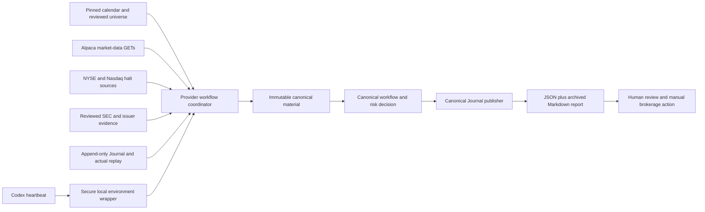

# Provider-Backed Read-Only Monitoring Design

**Date:** 2026-08-21

**Status:** Approved scope; unattended implementation authorized; activation
remains gated by verification

**Branch:** `codex/provider-backed-monitoring`

**Workspace:** `/Users/jbuenosantan/Documents/ChatGPT/Stock Monitor`

## Summary

This change activates the existing read-only Alpaca market-data foundation and
adds canonical non-fixture local composition for premarket and close reports. It then
connects those commands to three Codex heartbeat automations only after the
provider and both manual workflows pass their activation gates.

The monitor remains decision support. It never accesses Robinhood, never calls
a brokerage or trading endpoint, never places or modifies an order, and never
enables live options. Alpaca Paper Trading credentials are used only as headers
on approved market-data `GET` requests to `data.alpaca.markets`.

The implementation must preserve the existing fail-closed publication,
journal, source-authority, replay, risk, and manual-confirmation boundaries.
Recorded fixtures remain test evidence and can never authorize a canonical
report.

## Approved Scope and Invariants

The project keeps the operating limits already recorded in the repository:

- Cash-only, long-only stocks and approved ETFs.
- Two-to-ten-trading-day intended holds.
- At most two open positions and one new entry per session.
- At most $25 planned risk per position, $50 combined planned open risk, and
  $1,000 actual live stocks/ETFs exposure during validation.
- New live entries pause after three consecutive losses, a $100 weekly
  drawdown, or a $250 monthly drawdown.
- All brokerage verification and execution remain manual.
- Options remain paper-only until a separate, external four-week and
  twenty-closed-trade review; this change provides no live-options path.
- `NO TRADE` is a valid successful result only when complete, current evidence
  proves that no candidate qualifies. Missing evidence is a nonzero failure,
  not a synthetic `NO TRADE`.
- Every nonzero workflow result contains zero candidates and authorizes no
  position action.
- A missed unattended run is never backfilled and never reuses a prior report.

## Non-Goals

- Brokerage account connectivity or order management
- Robinhood credentials, cookies, sessions, scraping, or private APIs
- Alpaca trading endpoints, account endpoints, or order endpoints
- Live options or automatic promotion of either validation phase
- Replacing reviewed evidence with model inference, news summaries, or an
  unreviewed web source
- Treating IEX as consolidated/NBBO data
- Guaranteed returns, income targets, or financial advice

## Current Baseline and Activation Gaps

The repository already has a strong read-only provider and authority
foundation:

- `HttpGetClient` restricts egress to exact reviewed HTTPS `GET` requests.
- `AlpacaMarketData` supports entitlement smoke checks, split-adjusted SIP
  daily bars, historical SIP quotes/bars, and current IEX quotes.
- `ReferenceClient` supports exact configured NYSE/Nasdaq source retrieval and
  role-bound halt/status parsing.
- `SecClient` supports rate-limited official SEC submissions and archive reads.
- Journal, screening, risk, reconciliation, report, fixture, scheduling, and
  secret-redaction layers are already present.

Canonical non-fixture activation is currently blocked by deliberate boundaries and
missing composition:

- `provider smoke` is unconditionally rejected by the CLI.
- A run without `--fixture` is unconditionally rejected.
- `RecordedScenarioAdapter` is the only concrete `WorkflowAdapter`.
- `JournalWorkflowPublisher` accepts only fixture-issued workflow material.
- `data/evidence/current.json` is an empty, subjectless registry.
- Stock universe records do not expose the issuer CIK and initial-listing date
  required by canonical non-fixture candidate contexts.
- Actual-position replay lacks trusted persisted signal-plan lineage needed for
  close risk decisions.
- The scheduler accepts only the exact intended minute, which is too narrow for
  heartbeat dispatch latency.

No implementation may weaken an existing guard merely to make these commands
return success.

## Target Architecture



The implementation is divided into three dependent slices.

### Slice 1: provider activation

Wire `provider smoke` to the existing `AlpacaMarketData.smoke()` path. A smoke
run is ready only when all of the following are true in the same invocation:

- credentials authenticate to the approved market-data host;
- a current IEX observation is present, complete, correctly labeled, and fresh;
- delayed historical SIP data for an explicitly completed market session is
  available, complete, and correctly labeled;
- transport, response, timestamp, and entitlement checks all pass.

Authentication alone is not readiness. The command emits only an allowlisted,
secret-safe JSON projection. It never emits headers, credentials, raw provider
bodies, URLs containing sensitive query values, or exception details.

### Slice 2: canonical provider workflows

Add a canonical non-fixture adapter/coordinator that composes existing domain APIs. The
coordinator owns collection ordering, Journal persistence, authority issuance,
and error normalization. Screening, risk, reconciliation, and report rendering
remain separate domain layers.

The recommended implementation seam is a new module such as
`stock_monitor.provider_workflows` containing:

- `ProviderWorkflowAdapter`, the concrete canonical non-fixture `WorkflowAdapter`;
- `CanonicalPremarketMaterial`, the exact immutable output of one premarket
  composition;
- `CanonicalCloseMaterial`, the exact immutable output of one close
  composition;
- Journal-backed composition services that issue those values only after all
  source rows and state fingerprints are stable.

The canonical public seam is explicit: `ProviderWorkflowAdapter` implements a
new `CanonicalWorkflowAdapter` protocol whose `premarket_material()` and
`close_material()` methods return the exact issued composite values. A separate
`CanonicalWorkflowPublisher.publish(..., result, material)` signature receives
that same value. Canonical workflow functions pass the material directly from
adapter to renderer to publisher; it is never recovered from mutable adapter
state. The material is registered as an untampered, Journal-owned capability,
while `WorkflowResult` remains unchanged and contains no serializable authority.
Fixture workflows keep the existing `WorkflowAdapter` and
`JournalWorkflowPublisher` signature. The scheduler has explicit fixture and
canonical contexts and cannot mix their adapters or publishers.

### Slice 3: unattended Codex heartbeats

After provider smoke and both current manual canonical workflows pass, create
three weekday heartbeat automations in America/New_York:

- 08:45 premarket
- 12:30 early-close check
- 15:30 normal-close review

The automation invokes the same reviewed CLI path as a manual run. It does not
contain secrets and does not broaden the network or brokerage boundary.

## Source and Evidence Model

### Market data

The premarket coordinator collects one coherent cohort:

1. Exactly 60 aligned, split-adjusted SIP daily bars for the complete eligible
   and support-symbol cohort derived from one checksum-verified universe
   snapshot, ending on the expected completed session. The initial snapshot
   currently contains seven symbols, but the code does not hard-code that
   count.
2. Previous-session SIP quotes in the 15:55-16:00 ET regular-hours window for
   the liquidity score.
3. Current IEX quotes for freshness only.
4. A provider smoke result proving both current IEX and delayed SIP access.

An incomplete symbol cohort, pagination gap, timestamp mismatch, future
observation, stale observation, wrong feed, or entitlement mismatch invalidates
the entire decision cohort.

Close reviews use one exact conservative mark algorithm. Let `cutoff` be the
earlier of the decision time minus 16 minutes and the reviewed session close.
For each visible symbol, request SIP historical quotes over the five-minute
window ending at `cutoff`, reject crossed, non-positive, future, or
out-of-window quotes, and select the greatest provider timestamp. Conflicting
quotes at the same greatest timestamp fail closed. The authoritative mark is
that quote's positive bid. It must be no more than five minutes older than
`cutoff` and therefore no more than 21 minutes older than decision time; there
is no trade, IEX, cache, or prior-report fallback. Historical SIP minute bars
through the same cutoff supply current-session low material, and completed SIP
daily bars supply ATR/history. Current IEX must separately be fresh within five
minutes, but remains only a freshness attestation and is never promoted to an
NBBO or total-market mark. Reports continue to require the operator to verify
current price and spread manually before acting.

### Halt and operational status

For every candidate, the coordinator retrieves and parses all three configured
machine-readable status sources:

- Nasdaq primary trade-halt feed;
- Nasdaq trader-alert feed;
- NYSE operational-status feed.

`classify_instrument_status()` must receive complete, fresh, role-bound
snapshots. Unsupported configured calendar HTML must not be treated as parsed
operational proof. The pinned reviewed local calendar determines open/closed
and early-close session times; the status feeds can block but cannot invent a
session.

### Reviewed subject evidence

Canonical non-fixture screening needs one current reviewed bundle per universe
subject, not the current empty subjectless placeholder. A new release manifest
at `data/evidence/current.json` pins the reviewed universe digest plus one
relative subject-file path and SHA-256 for every eligible/support symbol.
Subject files retain the existing subject-scoped evidence-bundle schema. A new
`load_current_evidence_release()` verifies the top-level compiled release hash,
path confinement, exact child hashes, unique subject identities, stock CIK
agreement, complete universe coverage, and `reviewed_at`/`review_by` bounds,
then returns an immutable symbol-to-bundle mapping. The single-subject loader
remains available only for existing replay/unit seams.

Before activation:

- stock records gain an explicit normalized issuer CIK and reviewed initial
  listing date;
- every stock/ETF has subject-matched event coverage for the intended holding
  window;
- stock evidence records bind official SEC or issuer-primary documents to the
  exact CIK/symbol;
- ETF records bind official sponsor or index-provider evidence to the exact
  symbol;
- coverage attestations distinguish clear coverage from unknown, unsupported,
  stale, or conflicting coverage;
- every document and normalized evidence record carries its primary URL,
  source time, retrieval time, content digest, and review identity.

Subject evidence must be no older than the existing 24-hour policy window at
the decision cutoff, and active-halt coverage must be no older than five
minutes. Listing age must exceed 90 calendar days. The existing price, volume,
free-float, spread, product, score, and holding-window gates remain unchanged.

Refreshing the evidence release is an explicit source-review and repin
operation; scheduled workflows never rewrite it. Once `review_by` or any
subject coverage expires, unattended premarket fails closed with exit `3` and
zero candidates until a new reviewed release is installed. Provider/SEC
retrieval alone cannot silently refresh or extend the review.

An SEC fetch supplies raw primary evidence; it does not constitute human
review or automatically mint an `EvidenceDecision`. Unknown or incomplete
event coverage disqualifies the subject and may block the whole cohort when a
required support symbol is affected.

### Persistence before decision

Every provider/reference/SEC response used by a report is content-addressed and
appended to `source_observations` before the final decision is issued. Provider
pages are read through `read_provider_fetch_bundle()` and each distinct raw
page retains its external observation identity in Journal details.

Reviewed local releases are also real evidence, not dummy rows. The exact
calendar, universe, policy, and evidence-release bytes are stored under stable
`stock-monitor://reviewed/.../<sha256>` identities with their content hashes and
review times. `append_source_observation()` gains a typed receipt/readback API
containing row ID, observation digest, payload digest, and Journal owner.
Market-closed and no-candidate branches bind these local release receipts;
partially collected data failures bind the local receipts plus every actual
external observation collected before failure. A configuration error that
prevents safely opening the canonical Journal returns exit `2` without
claiming or archiving a report.

Journal writes intentionally advance the Journal generation. Therefore the
coordinator must finish all source writes, then re-read/reissue the candidate,
portfolio, plan, report, and publication authorities from the stable snapshot.
It may not reuse an authority minted before a Journal write.

## Premarket Composition

For an open session, the canonical non-fixture premarket flow is:

1. Establish three times: fixed economic `decision_at` at 08:45 ET, actual
   `retrieved_at` when collection starts inside the due window, and actual
   `published_at`. Completed-session scoring inputs and canonical portfolio
   replay are bounded by `decision_at`; later IEX/halt observations may only
   attest health or add a conservative block and cannot improve a score or
   capacity decision.
2. Validate configuration and load the reviewed calendar and universe.
3. Prove provider readiness and collect the complete market-data cohort.
4. Collect and persist the three halt/status sources.
5. Load current subject metadata and reviewed evidence for each eligible
   universe record.
6. Construct one `CandidateContext` per eligible record.
7. Run the existing base-eligibility, scoring, conversion, and deterministic
   ranking APIs.
8. Read current canonical portfolio authority at exact `decision_at` from the
   Journal.
9. Plan only the rank-one `PRIMARY` candidate through `plan_long()` and bind
   the ranking to that exact plan/publication decision.
10. Render and publish from one immutable `CanonicalPremarketMaterial` containing
   the snapshot, primary plan, publication decision, report projection, source
   row IDs, and state digest.

Up to two additional ranked candidates may be shown as `WATCHLIST_SHADOW`, but
they are never sized, never become a fallback entry, and never carry a plan or
publication authority. Add a distinct `PremarketShadow` report projection with
score/setup/trigger context but no quantity, planned risk, or plan ID;
`CandidateSummary.material` accepts it only when the role is
`WATCHLIST_SHADOW`. `PremarketCandidate` remains positive-sized and is valid
only for `PRIMARY`. The renderer prints sizing fields as `N/A - WATCHLIST ONLY`
for the shadow projection. Only the primary candidate can enter the canonical
validation portfolio.

A complete cohort with no eligible rank returns exit `0` and `NO_TRADE` with a
canonical no-candidate state digest. Missing data/evidence returns exit `3` and
zero candidates. An active risk/policy breaker returns exit `4` and zero
candidates; this is an intentional change from the current exit-`0`
`NO_TRADE/ACTIVE_BREAKER` behavior and requires workflow, CLI, scheduler, and
stored-result compatibility tests. It is not relabeled as a market-data
failure.

## Close Composition

The close coordinator starts from the canonical Journal and manual actual
ledger, never from an assumed brokerage state. It uses a two-pass composition
because source-observation writes invalidate previously read Journal authority:

1. Establish fixed `review_at` from the reviewed session (12:30 ET early close
   or 15:30 ET normal close), actual `retrieved_at`, and one immutable actual
   `query_cutoff` captured at invocation start.
2. Read a discovery-only actual replay at `query_cutoff` to identify every
   visible symbol and reconciliation condition. No authority from this pass is
   used after a Journal write.
3. Collect and persist conservative SIP mark data and current IEX freshness for
   every visible position.
4. Collect required event/status evidence for the remaining holding window.
5. In one stable final read scope after all Journal writes, re-read actual
   replay at the same `query_cutoff`; re-resolve signal/plan and lifecycle
   lineage, latest eligible event review, prior close recommendations, and
   typed observation receipts.
6. Issue a public Journal-backed `ActualCloseSource`,
   `ActualPositionEventContext`, and source-backed close mark that keep
   `review_at` separate from each delayed quote's `observed_at`. The issuer
   verifies the exact SIP feed/delay/age/bid material, IEX freshness, actual
   replay, plan lineage, and Journal owner. The canonical post-close Phase 1
   exit issuer is not reused.
7. Build a risk `Position` only for fully resolved planned exposure and run
   `evaluate_position()` with the issued actual-close context and mark.
8. Produce one immutable `CanonicalCloseMaterial` containing actual replay,
   plan lineage, marks, evidence, source row IDs, per-position decisions, and a
   combined state digest.
9. Render and publish that exact material.

Current-universe freshness blocks new entries but cannot hide or drop a
persisted actual exposure from a close review. A discovered reconciliation
condition also retains precedence over later provider/source failures: the
outward report remains `RECONCILIATION_REQUIRED`, includes the visible exposure
and the provider/source failure as a secondary reason, and authorizes no
action. An error path that wrote any source row must obtain a new final replay
before it asserts reconciliation.

Planned lineage is resolved through a new cutoff-bound Journal selector that
maps each `ActualLot.source_cursor`/confirmation execution event to the exact
`Phase1LifecycleEventSource.confirmation_execution_event_id` and
`Phase1SignalSource`. Zero or multiple matches become `POSITION_UNVERIFIED`.
The initial stop and target come only from that persisted plan. Entered session
comes from the original actual opening lifecycle. Partial-target state comes
only from trusted lifecycle evidence. The current recommended stop is
`max(initial_stop, latest durable prior close recommendation)` so it can never
reset or widen; each new recommendation is appended durably. Missing or
ambiguous lineage skips `Position` construction and never invents a value.

An actual-only, unrelated, noncompliant, or incompletely reconciled position
remains visible in the report. It cannot be dropped because its plan is
missing. Instead it receives the appropriate unverified/reconciliation state
and authorizes no action.

Aggregate close precedence is:

1. `RECONCILIATION_REQUIRED`
2. `POSITION_UNVERIFIED`
3. `STOP_UNVERIFIED`
4. `DATA_UNAVAILABLE`
5. `EXIT`
6. `TIGHTEN_STOP`
7. `HOLD`

This precedence applies across mixed positions. For example, one missing mark
and one valid `EXIT` yields aggregate `DATA_UNAVAILABLE`/exit `3`; one
stop-unverified position plus another missing mark yields aggregate
`STOP_UNVERIFIED`/exit `4`. Every per-position status and reason remains in the
report, but any aggregate nonzero result authorizes no action.

Add role-dependent close projections rather than fabricating required numbers:
a verified `ClosePosition` carries mark/stop/target/action/reasons, while an
`UnverifiedClosePosition` carries identity, exact known exposure/cost fields,
status, and reasons with mark/stop/target explicitly absent. `CloseSnapshot`
retains all per-position decisions plus the aggregate state. If there are no
positions and all inputs are verified, close returns a verified `HOLD` with no
position action. Native provider, Journal, evidence, and risk exceptions are
normalized to safe workflow errors; raw exceptions never escape to JSON,
reports, or automation output.

Multiple actual fills use stored integer-microdollar total cost divided by
remaining whole shares. For a long risk-engine entry, any sub-microdollar
fraction is rounded toward positive infinity to exactly six decimal places so
risk is not understated; exact integer cost remains the P/L source of truth.
The Journal exposes a cutoff-bound selector for the latest eligible reviewed
event evidence and a typed readback receipt for every persisted source
observation used in the state digest.

## Canonical Publication Authority

Fixture and canonical publication remain separate authority paths:

- `JournalWorkflowPublisher` continues to accept only exact fixture-issued
  workflow material under a content-addressed fixture root.
- A separate canonical publisher accepts only exact untampered material issued
  by the canonical Journal-backed coordinator.
- A copied dataclass, caller-constructed value, mutated value, stale Journal
  generation, changed source observation, or changed dependency invalidates
  publication.
- The state hash covers the canonical decision, plan or close decision,
  observation identities, relevant Journal snapshot, and report projection.
- Publication is a crash-safe phased protocol, not a claimed cross-filesystem
  transaction. First claim the report. Next, one SQLite transaction finalizes
  report/pin/outbox rows, content hash, source-row bindings, and the
  archive-relative identity. Then write and byte/hash-verify the Markdown
  archive. A premarket report maps workflow kind `PREMARKET` to stored report
  kind `MORNING`; close maps to `CLOSE`.
- After the exact `MORNING` report is readable, reissue the plan/decision and
  call `publish_phase1_report()` in its separate SQLite transaction to persist
  signal/provider-manifest state. Terminal success is returned only after the
  archive and this Phase 1 publication both verify. A retry from
  `ALREADY_FINALIZED` heals/verifies the archive and idempotently completes or
  verifies Phase 1 publication before returning success. Scheduled completion
  is not recorded during a crash gap.
- `WorkflowResult.safe_fields()` continues to expose only allowlisted fields;
  publication capabilities and raw source material are never serialized.

Market-closed, no-candidate, breaker, no-position, and data-failure reports
also receive explicitly defined canonical evidence/state hashes. No result may
fabricate a dummy observation merely to satisfy the current report-evidence
shape.

## CLI and Secret Handling

The existing CLI surface remains:

```text
stock-monitor provider smoke --json
stock-monitor run premarket --json
stock-monitor run close --json
stock-monitor run premarket --scheduled --json
stock-monitor run close --scheduled --json
stock-monitor phase1 start --session YYYY-MM-DD --json
```

`phase1 start` is an explicit idempotent bootstrap, never an implicit side
effect of premarket. It validates that the supplied date is a reviewed open
session, derives a deterministic window ID, uses the locked $5,000 canonical
paper starting capital, calls `start_phase1_validation_window()`, and reads the
stored window back. An identical retry is a no-op; an existing conflicting
window fails closed. The first canonical premarket cannot run without this
verified window.

`--fixture` continues to select only `RecordedScenarioAdapter`. Its absence
selects only the canonical non-fixture provider adapter. No implicit fallback
exists between modes.

Add one reviewed local wrapper for unattended runs. It derives the repository
root and opens `.env` without following symlinks. The opened descriptor must be
a regular file owned by the current user, have link count one, and have no
group/world permission bits. A literal parser accepts exactly one assignment
for each of the four approved configuration variables, rejects unknown,
duplicate, missing, control-bearing, or malformed lines, and never uses
`source`, `eval`, interpolation, or command substitution. The wrapper disables
shell tracing, exports only those literal values to the existing configuration
loader, and invokes the existing CLI through one reviewed surface. It never
prints, copies, archives, or places credential values on the command line.
Tests cover command-substitution text, duplicate keys,
symlink/hardlink/mode/owner rejection, and swap-after-check resistance.

The wrapper and every new executable surface are included in the permanent
brokerage/network boundary tests. `.env`, the virtual environment, Journal,
cache, reports, and exports remain ignored and are never committed.

## Scheduled Timing and Deduplication

Codex heartbeats can start shortly after the nominal minute. The internal due
window becomes a bounded, fail-closed 15-minute half-open interval:

- premarket: 08:45:00 <= start < 09:00:00 ET;
- early close: 12:30:00 <= start < 12:45:00 ET;
- normal close: 15:30:00 <= start < 15:45:00 ET.

The nominal time remains the immutable economic decision/review time even when
dispatch starts later. Retrieval and publication keep their actual timestamps.
Premarket scoring and canonical portfolio reads are bounded at 08:45; close SIP
mark cutoff is bounded from the nominal 12:30/15:30 review time, not the later
dispatch time. Operational observations retrieved later in the window may only
block or attest health. They cannot add lookahead to a score, mark, or portfolio
capacity decision.

Canonical manual premarket and close activation runs use these same windows and
timestamp rules. A manual invocation outside its due window returns the same
not-due/missed behavior and does not satisfy an activation gate. Provider smoke
may run at any time because it creates no candidate or position action.

Before the intended time, the workflow returns `NOT_DUE_NOOP`. At or after the
window end, it records `MISSED_RUN_NOOP`; it never backfills. The durable claim
key remains one run kind per market session, so retries and the two close
heartbeats cannot produce duplicate canonical reports.

The 12:30 heartbeat first verifies the reviewed local calendar. It invokes
close only on a verified early-close session. The 15:30 heartbeat handles a
normal session and acts only as a deduplicated/missed-run observation on an
early-close session.

Each automation prompt uses the absolute stable main-checkout wrapper, contains
no credential values, captures the exact exit code and safe JSON, and reports a
nonzero result without inventing candidates/actions. All created automation
records are read back and compared with the intended name, schedule, timezone,
project, status, and prompt.

## Exit and Failure Semantics

| Exit | Meaning | Required outward behavior |
|---:|---|---|
| 0 | Complete report or defined no-op | May contain candidates only for a canonical `CANDIDATES` result |
| 2 | Configuration invalid/missing | Zero candidates; no action |
| 3 | Provider/source/evidence unavailable | Zero candidates; no action; never call it `NO_TRADE` |
| 4 | Policy/risk/verification block | Zero candidates; no action |
| 5 | Reconciliation or manual boundary required | Zero candidates; no action |
| 10 | Unexpected internal failure | Redacted generic output; zero candidates; no action |

Provider authentication errors, connectivity errors, malformed responses,
missing entitlement, stale data, and incomplete pagination retain distinct safe
reason codes even though they share exit `3`. A retry cannot turn an earlier
nonzero terminal result into a green `ALREADY_*` no-op.

## Verification and Activation Gates

Implementation follows red-green-refactor. Tests are added before each
canonical non-fixture change.

Required automated coverage includes:

- provider smoke success plus authentication, connectivity, entitlement,
  malformed-response, stale-IEX, missing-SIP, and incomplete-cohort failures;
- canonical non-fixture premarket and close paths, including provider/source
  exception normalization;
- complete premarket, no-candidate, active-breaker, missing-evidence, and
  journal-generation invalidation cases;
- actual replay plan lineage, no-position close, conservative marks,
  per-position reason preservation, unrelated exposure, reconciliation, and
  unverified stop/position cases;
- canonical publication accepts exact issued material and rejects copied,
  mutated, stale, cross-Journal, and fixture material;
- canary credentials never appear in stdout, stderr, reports, archives,
  exports, scheduled result envelopes, or errors;
- unchanged recursive no-brokerage/no-order/no-alternate-network boundary;
- 15-minute due-window boundaries, ET conversion, early-close routing,
  durable deduplication, crash recovery, and no backfill;
- exact stable exits and zero-candidate behavior for every nonzero result.

Activation is sequential:

1. Warning-strict unit, contract, integration, architecture, and security tests
   pass.
2. The updated universe and per-subject evidence release receive an explicit
   primary-source review and readback covering identities, validity windows,
   content hashes, and complete subject coverage.
3. `verify universe` and `verify calendar` pass in the canonical environment.
4. Real read-only `provider smoke` exits `0` with overall `READY` both
   interactively and through the exact unattended main-checkout
   wrapper/environment.
5. `phase1 start` creates or verifies the explicit $5,000 canonical validation
   window for the selected reviewed open session.
6. One real manual premarket run inside its due window completes and archives a
   reviewable canonical report.
7. One real manual close run inside its due window completes and archives a
   reviewable canonical report. A verified no-position `HOLD` is acceptable.
8. Only then are the three Codex automations created and read back.
9. The first unattended premarket and close reports remain prospective
   validation evidence. Status stays `PHASE1_BLOCKED_SCHEDULED_SMOKE` until
   both exact reports receive external human review; automation does not
   authorize execution or promotion.

If any live gate fails, schedules are not created. The repository can still be
committed and pushed with the exact activation blocker documented, provided all
offline tests and secret scans pass.

## Repository, Linear, and Release

All implementation occurs on `codex/provider-backed-monitoring`. Linear project
`Stock Monitor` is updated with the design, affected modules, test commands,
live-gate results, automation identities or blockers, and follow-up risks.

The user separately and explicitly authorized committing this project and
pushing it to the public `jpbueno/stock-monitor` repository. Before that
publication:

- inspect the staged diff explicitly;
- run whitespace and secret scans over tracked files and Git history being
  introduced;
- verify `.env` and runtime state are ignored;
- verify no credential value appears in commits, reports, prompts, or remote
  configuration;
- run the final warning-strict verification suite;
- merge the reviewed feature branch into local `main` and push `main` to
  `https://github.com/jpbueno/stock-monitor`.

The final handoff distinguishes offline verification, live provider smoke,
manual canonical runs, created automation records, and any boundary that could
not be proven.
